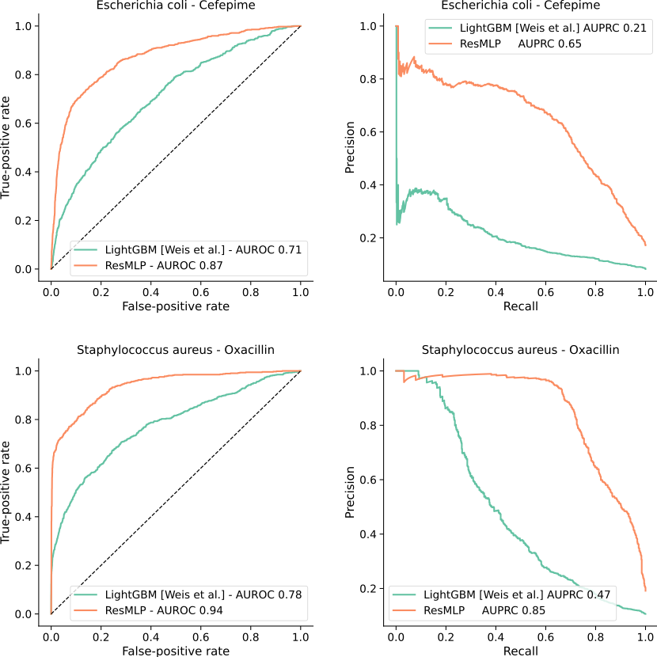
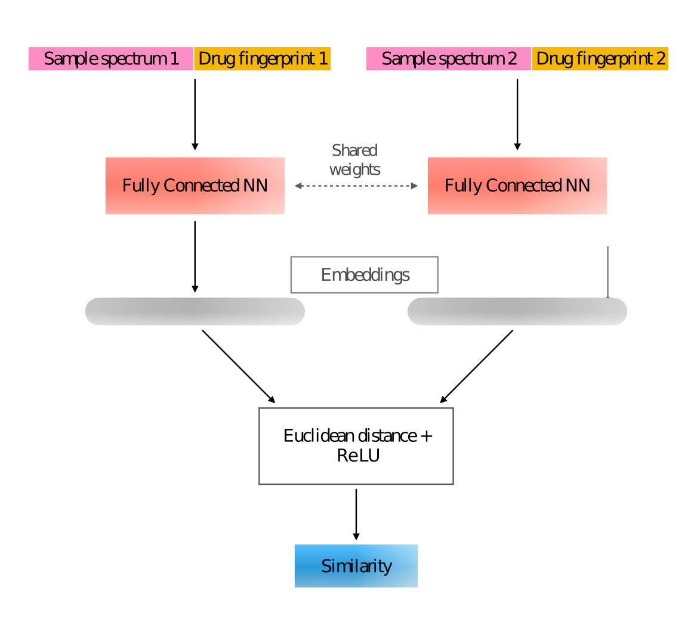
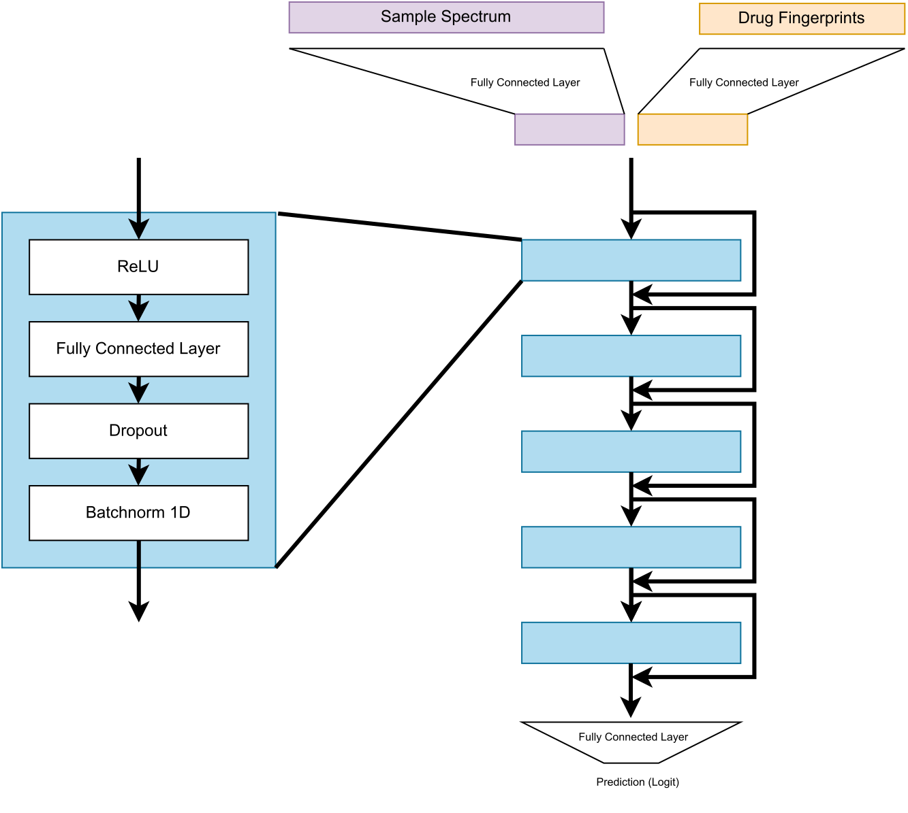

# A multimodal approach to antimicrobial resistance prediction for drug recommendation and large-scale classification.


This repository contains the code used to conduct experiments for the paper [_Multimodal learning in clinical proteomics: enhancing antimicrobial resistance prediction models with chemical information_](https://doi.org/10.1093/bioinformatics/btad717) from Giovanni Visonà, Diane Duroux, Lucas Miranda, Emese Sükei, Yiran Li, Karsten Borgwardt, and Carlos Oliver.

The paper present work aimed at predictiong Antimicrobial Resistance (AMR) using proteomic and chemical features, which is examined through two clinically relevant tasks: drug recommendation and generalized resistance prediction. We demonstrate how the multi-view representation of the pathogenic samples adopted paired with the use of deep learning to  leverage the scale of the available datasets substantially outperfors the previous single-drug and single-species predictive models.




The experiments are organized based on the authors that performed them, while the general utilities and processed data are contained in the `data_split` and `processed_data` forlders. 
`lm_experiments` contains scripts to evaluate the performance of some baseline machine learning models on individual drug-species subsets of the DRIAMS dataset.
`dd_experiments` includes the training of the Siamese Network model and the evaluation of all the recommendation models except the ResMLP.
`gv_experiments` contains scripts to train the baseline PCA+LR experiments and the scripts related to the ResMLP experiments, including classification, recommendation, and ablation experiments.


## Siamese Network model

The Siamese Network contains two identical subnetworks with shared weights that work in tandem on two input vectors composed of the MALDI-TOF mass spectra and the chemical fingerprints. The model is trained to minimize the difference between the actual and predicted similarity between pairs of observations



The code for the Siamese Netowork model is found in `dd_experiments/SiameseNetworks.py`


## ResMLP model

The ResMLP model includes two projections layers that bring the representations of the MALDI-TOF spectrum and the chemical fingerprint to the same latent dimensionality, before concatenating these vectors and propagating them through a feed-forward neural network with skip-connections.




To train a ResMLP classifier model with the same configuration as the one presented in the paper, the command used is:

```
cd gv_experiments

python3 training_scripts/train_ResAMR_classifier.py --experiment_name "myExperiment" --experiment_group "ResMLP" --driams_dataset "B" --seed 0 --split_type "random" --driams_long_table "../processed_data/DRIAMS_combined_long_table.csv"  --drugs_df "../processed_data/drug_fingerprints.csv" --spectra_matrix "../data/DRIAMS-B/spectra_binned_6000_2018.npy" --n_epochs 500 --learning_rate 0.0003 --drug_emb_type "fingerprint" --fingerprint_class "morgan_1024" --fingerprint_size 1024 --patience 50 --batch_size 128
```

The necessary files to run the script (the matrices of the processed spectra) are available on request.